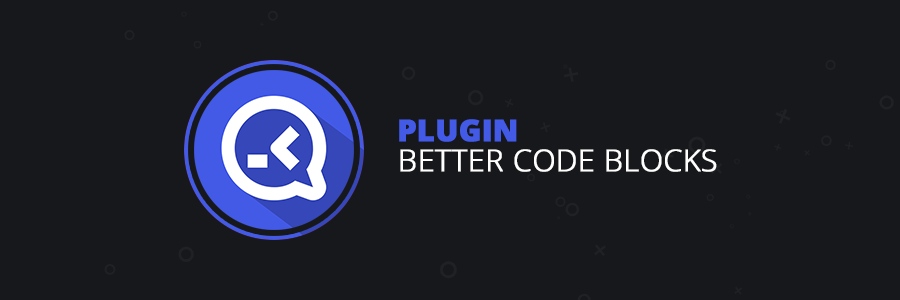
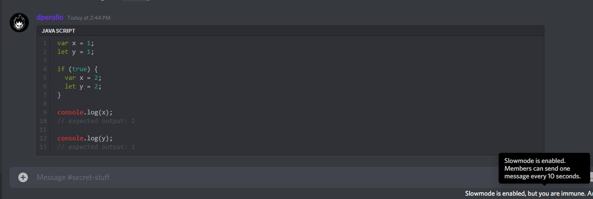

----

# Better Code Blocks

## Description

Extends the functionality of Discord code blocks, giving you options to show a copy button, language header (with or without icons), line numbers, and different syntax highlighting themes.

## Preview

## Todo

Add the following settings options:

- [ ] Include icons in language header
- [ ] Implement and add more syntax highlighting themes
